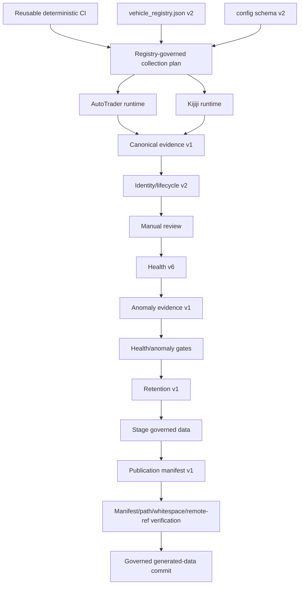

# Architecture and Data Flow

## Purpose

This document describes governed workflow orchestration, source execution, evidence boundaries, identity/lifecycle state, bounded retention, supported reporting, and authority limits.

## 1. Operational authority

`vehicle_registry.json` schema v2 controls enabled/paused state, source plan, purpose, priority, cadence metadata, and analysis profile. Each schema-v2 `config_*.json` controls criteria, origin, and source-specific queries. Kijiji labels must resolve through location-registry version 1.

## 2. Reproducible workflow architecture

Audit 08 separates three workflows:

- `.github/workflows/ci.yml` — reusable deterministic code CI for non-data pull-request changes, manual CI, and collection preflight
- `.github/workflows/generated-data.yml` — pull-request validation for `data/**` changes
- `.github/workflows/scrape.yml` — scheduled/manual collection only; it has no pull-request trigger

All use Ubuntu 24.04, Python `3.11.13`, exact `requirements.lock` pins, and GitHub-owned actions pinned to exact commit SHAs.

Collection cannot start until reusable CI succeeds. Scheduled collection runs Mondays at 08:00 UTC. Manual collection exposes explicit full/single-pair, active vehicle, source, publication, anomaly-policy, and operator-note inputs. `workflow_control.py` resolves every plan from the registry and rejects paused, unknown, disabled, empty, or malformed plans.

## 3. Direct source paths

### AutoTrader

```text
schema-v2 config
  → autotrader_run.py
    → autotrader_adapter.py
      → requests/pages/response listing objects
      → adapter evidence schema v1
    → autotrader_canonical.py
      → canonical evidence schema v1
    → identity_lifecycle.py v2
    → source status schema v8
```

Fetched scope is `autotrader_adapter_response_listing_objects`. Request attempts, pagination, duplicates, exclusions, parse failures, and route/geodesic/unavailable distance evidence remain explicit.

### Kijiji

```text
schema-v2 config
  → kijiji_run.py
    → kijiji_locations.py validated hub plan
    → kijiji_adapter.py
      → requests/pages/JSON-LD listing objects
      → adapter evidence schema v1
    → kijiji_canonical.py
      → canonical evidence schema v1
    → identity_lifecycle.py v2
    → source status schema v8
```

Fetched scope is `kijiji_adapter_json_ld_listing_objects`. Query hub is provenance only, URL region is separate unverified evidence, listing geography is listing-specific source evidence or unknown, and distance remains disabled.

## 4. Canonical boundary

```text
fetched_records = accepted_records + rejected_records + parse_failures
```

Canonical schema v1 preserves raw payload evidence, null-safe normalized values, stable source-scoped canonical listing IDs, run observations, field evidence statuses, explicit reasons, and reconciliation. Canonical IDs identify listing claims within a source; they are not VINs or physical-vehicle identity.

## 5. Identity and lifecycle boundary

`identity_lifecycle.py` runs only after collection, freshness, schema, pagination, canonical reconciliation, accepted/output agreement, and config isolation pass.

Per-source state records source-ID/VIN separation, explicit VIN evidence, explainable fingerprints, `active`/`missing`/`reappeared`/`retired` states, exact timestamps, elapsed time, and run-idempotent price observations. Retirement requires three consecutive successful-source-run misses and fourteen elapsed days. These states are operational inferences, not source-confirmed sold/removal claims.

Before each source run, identity artifacts are snapshotted. Any unhealthy result restores prior state; failed runs cannot advance missing or retirement counters.

Identity schema v2 keeps total price-observation counts, first/previous/current/minimum/maximum price, the newest thirteen raw observations, and count/digest evidence for compacted observations. It keeps at most 500 retired listings per source and no retired tombstone more than 365 days past last successful observation. Digests prove accounting order, not raw reconstructability.

## 6. Duplicate candidates and reporting

After current source identities are available, `phase1_reporting.py` builds high/medium/low cross-source duplicate candidates with visible reasons and `candidate_only_not_merged`. Candidates never delete, suppress, rewrite, or merge canonical records.

Manual review joins accepted canonical records one-to-one with current identity records. Wrong-run, wrong-schema, missing, corrupt, or count-mismatched identity evidence excludes the source and triggers the fail-closed guard. Source status remains schema v8; consolidated health remains schema v6.

## 7. Storage-retention boundary

After full-run source health passes, `storage_retention.py` schema v1 preserves current `*_latest` evidence, keeps eight timestamped source CSVs per active vehicle/source and four manual-review CSVs per active vehicle, removes older matching archives and active-vehicle legacy history/merged CSVs, records SHA-256 deletion evidence, bounds detailed deletion history to 100 records, enforces 50 MiB per managed file and 500 MiB total active managed data, and leaves paused F-150/Tundra data untouched.

## 8. Anomaly boundary

Before collection, the workflow snapshots the previously committed health report. `workflow_anomalies.py` schema v1 compares the current health report with that baseline and writes:

```text
data/run_status/anomalies_latest.json
data/run_status/anomalies_latest.md
```

It reports unhealthy sources, severe accepted/fetched collapses, material count shifts, elevated parse-failure rates, quality-warning growth, and pagination/request anomalies when those metrics are present. Missing or same-run baselines remain explicit. Critical anomalies block scheduled publication and manual publication under `enforce`; `report_only` is an explicit manual policy and never hides the report.

## 9. Generated-data publication boundary

A publishable full run must pass reusable CI, registry/config validation, governed planning, source/canonical/identity processing, reporting, source health, anomaly policy, retention, staged-path validation, publication-manifest verification, whitespace checks, and a remote-ref unchanged check.

`generated_data_publish.py` schema v1 writes:

```text
data/run_status/publication_latest.json
```

The manifest records run ID, source commit SHA, workflow event, target ref, exact published paths, and change-type counts. It must exactly match the staged governed data paths. No data change means no commit; a changed remote ref blocks the push.

Generated-data pull requests run `.github/workflows/generated-data.yml`, which validates active/paused scope, retention, changed source status, health, anomaly evidence, and publication-manifest membership. Data-only changes no longer receive acknowledgement-only success.

## 10. Current data flow



## 11. Artifact map

Adapter and canonical evidence:

```text
data/<vehicle>/adapter_evidence/<source>/...
data/<vehicle>/evidence/<source>/...
```

Identity/lifecycle evidence:

```text
data/<vehicle>/identity_lifecycle/<source>/state_latest.json
data/<vehicle>/identity_lifecycle/<source>/current_latest.jsonl
data/<vehicle>/identity_lifecycle/<source>/events_latest.jsonl
data/<vehicle>/identity_lifecycle/<source>/summary_latest.json
data/<vehicle>/identity_lifecycle/duplicate_candidates_latest.jsonl
```

Retention, review, health, anomaly, and publication evidence:

```text
data/<vehicle>/retention/latest.json
data/<vehicle>/retention/deletion_ledger.json
data/<vehicle>/manual_review/<vehicle>_manual_review_latest.csv
data/<vehicle>/run_status/<source>_latest.json
data/retention/latest.json
data/run_status/latest.json
data/run_status/latest.md
data/run_status/anomalies_latest.json
data/run_status/anomalies_latest.md
data/run_status/publication_latest.json
```

## 12. Authority boundaries

- Registry controls operational scope; configs control criteria/query plans.
- Source values, VIN claims, and normalized values are evidence, not verified truth.
- Query provenance is not listing geography.
- Accepted means eligible for manual review, not recommended.
- Duplicate candidate means compare manually, not merge.
- Missing/retired do not prove sold status.
- Anomaly policy governs workflow publication, not vehicle quality or purchase suitability.
- Publication manifests prove staged-path accounting, not marketplace truth.
- Audit 09 owns buyer intelligence; Audit 10 owns purpose outputs; Audit 11 owns optional vehicles.
- The owner retains purchase, merge, and roadmap authority.
