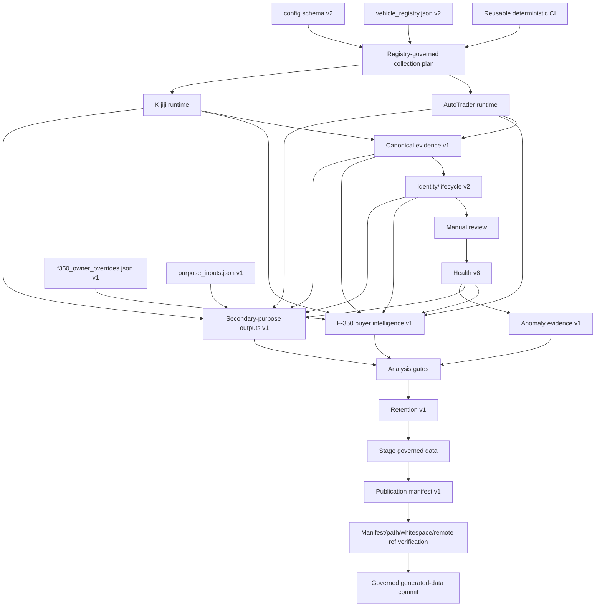

# Architecture and Data Flow

## Purpose

This document describes governed workflow orchestration, source execution, canonical and identity evidence, F-350 buyer intelligence, secondary-purpose outputs, bounded retention, publication, and authority limits.

## 1. Operational authority

`vehicle_registry.json` schema v2 controls enabled/paused state, source plan, purpose, priority, cadence metadata, and analysis profile. Each schema-v2 `config_*.json` controls acceptance criteria, origin, and source-specific queries. Kijiji labels must resolve through location-registry version 1.

Non-generated analysis inputs are separate from collection authority:

- `f350_owner_overrides.json` schema v1 controls only F-350 owner annotations and reasoned classification overrides.
- `purpose_inputs.json` schema v1 records owner-reported subject context or family-friend preferences for the four secondary vehicles.

Neither file can change source claims, canonical evidence, identity state, source acceptance, or query plans.

## 2. Reproducible workflow architecture

The repository separates three workflows:

- `.github/workflows/ci.yml` — reusable deterministic code CI
- `.github/workflows/generated-data.yml` — validation for `data/**` pull-request changes
- `.github/workflows/scrape.yml` — scheduled/manual collection only; no pull-request trigger

All use Ubuntu 24.04, Python `3.11.13`, exact `requirements.lock` pins, and GitHub-owned actions pinned to exact commit SHAs. Collection cannot begin before reusable CI succeeds.

## 3. Direct source paths

### AutoTrader

```text
schema-v2 config
  → autotrader_run.py
    → autotrader_adapter.py
      → request/page/response listing objects
      → adapter evidence schema v1
    → autotrader_canonical.py
      → canonical evidence schema v1
    → identity_lifecycle.py v2
    → source status schema v8
```

Fetched scope is `autotrader_adapter_response_listing_objects`.

### Kijiji

```text
schema-v2 config
  → kijiji_run.py
    → kijiji_locations.py validated hub plan
    → kijiji_adapter.py
      → request/page/JSON-LD listing objects
      → adapter evidence schema v1
    → kijiji_canonical.py
      → canonical evidence schema v1
    → identity_lifecycle.py v2
    → source status schema v8
```

Fetched scope is `kijiji_adapter_json_ld_listing_objects`. Query hub remains provenance only. Listing geography is listing-specific unverified evidence or unknown; Kijiji distance remains disabled.

## 4. Canonical boundary

```text
fetched_records = accepted_records + rejected_records + parse_failures
```

Canonical schema v1 preserves raw payload evidence, null-safe normalized values, stable source-scoped canonical IDs, observations, field evidence statuses, reasons, and reconciliation. Canonical IDs identify source listing claims; they are not VINs or physical-vehicle identity.

## 5. Identity and lifecycle boundary

`identity_lifecycle.py` runs only after freshness, schema, pagination, reconciliation, accepted/output agreement, and config isolation pass.

Identity schema v2 records source-ID/VIN separation, explicit VIN evidence, explainable fingerprints, `active`/`missing`/`reappeared`/`retired` states, actual timestamps, and run-idempotent price observations. Any unhealthy source result restores prior identity state.

Retirement requires three consecutive successful-source-run misses and fourteen elapsed days. Price state preserves aggregate history plus the newest thirteen raw observations and compaction evidence. Retired state remains an operational inference, not a sold claim.

## 6. General reporting

`phase1_reporting.py` builds non-destructive duplicate candidates and the general manual-review CSV. Manual review joins accepted canonical records one-to-one with current identity records and fails closed on missing, wrong-run, wrong-schema, corrupt, or count-mismatched evidence.

## 7. F-350 buyer-intelligence boundary

`f350_buyer_intelligence.py` schema v1 runs only for `ford_f350` and joins:

```text
source status v8
  + accepted canonical evidence v1
  + matching raw adapter payload v1
  + current identity/lifecycle v2
  + F-350 owner override input v1
  → F-350 buyer intelligence v1
```

It may expose unverified source-text claims for truck configuration, engine/idle hours, service/history, and prior use. It provides visible asking-price quartiles, descriptive mileage regression, seller questions, and explainable non-ranked classifications. Missing evidence stays unknown. Asking-price calculations are not appraisal, transaction-price, or future-value authority.

## 8. Secondary-purpose boundary

`purpose_outputs.py` schema v1 runs only for the four active secondary vehicles and joins:

```text
source status v8
  + accepted canonical evidence v1
  + matching raw adapter payload v1
  + current identity/lifecycle v2
  + purpose_inputs.json v1
  → secondary-purpose output v1
```

`purpose_output_validation.py` schema v1 re-joins the underlying current evidence and fails on disconnected IDs, wrong sources, missing references, count drift, wrong profile, malformed artifacts, or any `rank`/`score` key or column.

### Owned-vehicle value profile

`ram_3500` and `subaru_forester` use `owned_vehicle_value`.

Output includes current accepted comparables, subject-profile comparability, asking-price/mileage distributions, actual previous-observation price changes, and missing owner inputs.

Comparability labels are:

- `close_subject_comparable`
- `partial_subject_comparable`
- `broad_market_context`
- `subject_profile_incomplete`
- `insufficient_configuration_evidence`

The RAM profile preserves historical owner-reported context as unverified. Its historic “just over 400,000 km” statement never becomes current odometer. The Forester remains broad market context until the owner supplies its subject profile.

The Q1-to-median lower asking band carries:

```text
lower_observed_asking_band_not_verified_faster_sale_range_or_sale_probability
```

Price-change direction uses only listings with real previous price observations. Fewer than three produces `insufficient_multi_run_history`. It is asking-price change context, not market-value trend or sale evidence.

### Family-friend purchase profile

`honda_odyssey` and `kia_carnival` use `family_friend_purchase`.

The output may expose unverified seating, cargo-feature, sliding-door, service, accident/title, seller, location, and distance claims already supported by source evidence. It generates practical seller questions and candidate labels:

- `candidate_pending_requirements`
- `candidate_outside_stated_preferences`
- `candidate_with_evidence_gaps`
- `candidate_for_manual_review`

Incomplete friend preferences force `candidate_pending_requirements`; operational config acceptance is not treated as personalized shortlisting. No truck-specific engine-hour, cab, box, SRW/DRW, towing, diesel, or modification assumption is imported.

## 9. Workflow placement

A secondary-vehicle `single_pair` run builds and validates only the selected vehicle's purpose output and places it in the seven-day smoke artifact. It never publishes generated data.

After a full run's consolidated source-health gate passes, the workflow builds and validates:

1. F-350 buyer intelligence
2. RAM 3500 value monitoring
3. Subaru Forester value monitoring
4. Honda Odyssey candidate review
5. Kia Carnival candidate review

Only then may anomaly enforcement, retention, staging, manifest verification, and publication continue.

## 10. Storage and retention boundary

`storage_retention.py` schema v1 bounds active generated data and preserves current `*_latest` purpose artifacts. Audit 10 does not create timestamped purpose-output archives. Paused F-150/Tundra data remains outside collection and deletion scope.

## 11. Anomaly and publication boundaries

`workflow_anomalies.py` schema v1 compares current health with the previous committed baseline. Anomaly evidence is a workflow diagnostic, not a vehicle-quality conclusion.

A publishable full run must pass reusable CI, registry/config validation, governed planning, source/canonical/identity processing, general reporting, source health, F-350 and secondary-purpose validation, anomaly policy, retention, staged-path validation, publication-manifest verification, whitespace checks, and remote-ref stability.

Generated-data pull requests revalidate any changed F-350 or secondary-purpose artifact against current underlying evidence.

## 12. Current data flow



## 13. Artifact map

F-350:

```text
data/ford_f350/buyer_intelligence/...
```

Owned vehicle value:

```text
data/<ram_3500|subaru_forester>/purpose_output/value_monitor/...
```

Family candidate review:

```text
data/<honda_odyssey|kia_carnival>/purpose_output/family_candidate/...
```

Common evidence remains under adapter, canonical, identity, manual-review, run-status, retention, anomaly, and publication paths.

## 14. Authority boundaries

- Registry controls operational scope; configs control criteria and query plans.
- Non-generated owner/friend inputs control only purpose interpretation.
- Source and extracted values remain unverified evidence.
- Accepted means eligible for review, not recommended.
- Asking-price distributions are not appraisal or transaction-price evidence.
- A lower asking band is not a verified faster-sale range.
- Missing owner/friend inputs cannot be inferred.
- Comparability and candidate labels are explainable review categories, not ranks or scores.
- Seller questions are prompts, not defect findings or verified answers.
- Audit 09 owns F-350 buyer intelligence; Audit 10 owns secondary purposes; Audit 11 owns optional vehicles.
- The owner retains purchase, merge, and roadmap authority.
