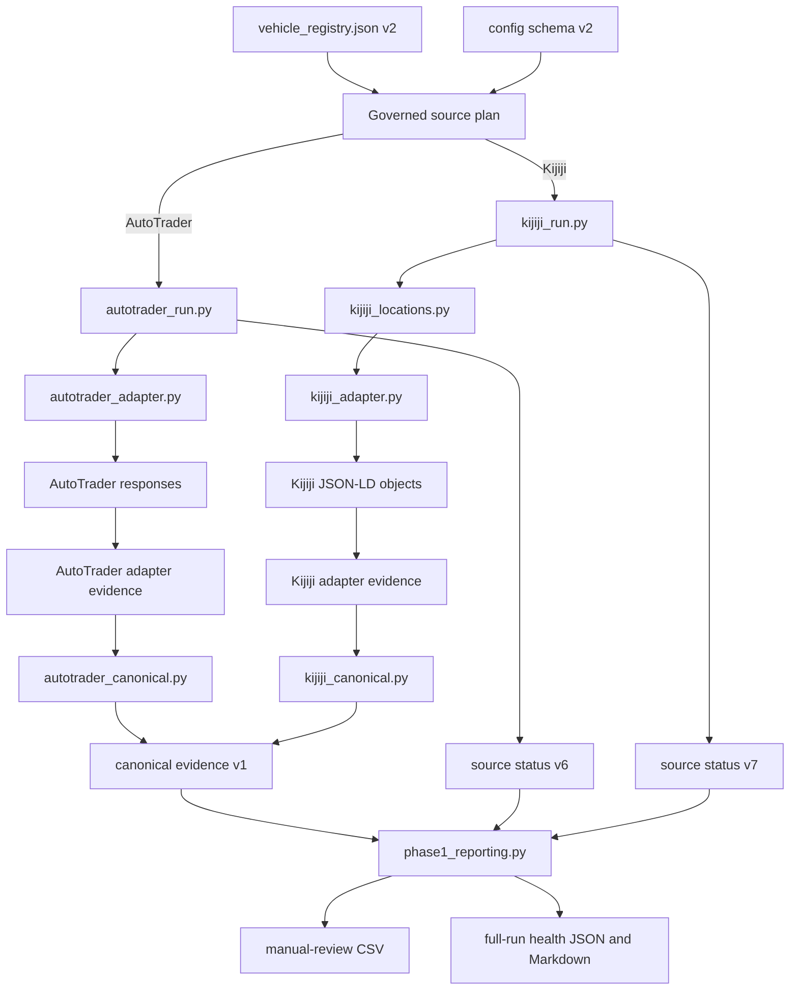

# Architecture and Data Flow

## Purpose

This document describes the governed execution paths, source boundaries, generated evidence, and remaining compatibility components.

## 1. Operational authority

`vehicle_registry.json` schema v2 controls enabled/paused state, purpose, priority, cadence metadata, enabled sources, analysis profile, and pause reason.

Each `config_*.json` schema-v2 file controls shared criteria, origin, and separate AutoTrader/Kijiji make, model, and query settings. `vehicle_config.py` rejects obsolete/invalid fields and requires every Kijiji query label to resolve through `kijiji_locations.py` registry version 1.

## 2. Workflow orchestration

`.github/workflows/scrape.yml` provides:

- pull request: compilation, registry/config validation, structured tests
- scheduled full run: complete registry plan and generated-data commit
- manual full run: complete registry plan; commit only when explicitly enabled
- manual single-pair run: one governed vehicle/source pair, source-health validation, artifact upload, no repository commit
- generated-data PR event: acknowledgement only

The single-pair path is a limited Audits 04–05 validation control. Audit 08 owns the final workflow architecture.

## 3. AutoTrader direct adapter

```text
schema-v2 config
  → autotrader_run.py
    → autotrader_adapter.py
      → AutoTrader page requests
      → adapter request/record/reconciliation evidence
    → autotrader_canonical.py
      → canonical evidence schema v1
    → source status schema v6
```

`autotrader_adapter.py` builds explicit requests, retries bounded transient failures, records every attempt/page, paginates by size/offset, detects incomplete/repeated pages, preserves every returned listing object, records duplicate/rejection/parse reasons, produces unranked accepted rows, and never mutates config.

AutoTrader fetched scope is `autotrader_adapter_response_listing_objects`.

Distance methods are `route_api_address`, `route_api_city_center`, `geodesic_address`, `geodesic_city_center`, or `unavailable`; evidence status distinguishes routed, straight-line estimate, and unavailable.

## 4. Kijiji direct adapter

```text
schema-v2 config
  → kijiji_run.py
    → kijiji_locations.py validated hub plan
    → kijiji_adapter.py
      → Kijiji Cars & Trucks page requests
      → JSON-LD listing objects
      → adapter request/record/reconciliation evidence
    → kijiji_canonical.py
      → canonical evidence schema v1
    → source status schema v7
```

`kijiji_adapter.py`:

- resolves only explicit validated hub labels/slugs/location IDs
- has no `l0` fallback
- retries bounded transient failures and records attempts
- paginates until empty/short page or visible incomplete stop
- parses JSON-LD `ItemList`, `Vehicle`, `Car`, and `Product` objects
- preserves every returned object as accepted, rejected, or parse failure
- records duplicates and criteria exclusions with reasons
- emits no rank or score and never mutates config or locations

Kijiji fetched scope is `kijiji_adapter_json_ld_listing_objects`.

### Kijiji geography boundary

Query hub, URL region, and listing geography are distinct evidence:

- query hub is request provenance only
- URL region is `unverified_url_evidence`
- `location`/`dealer_address` are populated only from listing-specific structured source fields
- listing-specific geography is labelled `source_reported_listing_specific_unverified`
- missing listing geography remains null/`unknown`
- query origin never becomes location, address, or distance

Kijiji distance processing/filtering remains disabled. `distance_km` is null, method is `disabled_listing_location_not_routed`, and evidence status is `disabled_no_verified_route`.

The former `phase1_kijiji_runner.py` runtime text-patching/`exec` path is removed. `kijiji_scraper.py` is only a compatibility alias into `kijiji_run.py`.

## 5. Canonical evidence

For every source:

```text
fetched_records = accepted_records + rejected_records + parse_failures
```

Canonical schema v1 provides exact raw evidence, typed/null-safe values, stable source-scoped listing IDs, run observations, field evidence statuses, accepted/rejected/parse-failure artifacts, reasons, and reconciliation.

| Source | Fetched boundary |
|---|---|
| AutoTrader | `autotrader_adapter_response_listing_objects` |
| Kijiji | `kijiji_adapter_json_ld_listing_objects` |

Neither boundary proves complete marketplace coverage.

## 6. Evidence-backed reporting

`phase1_reporting.py`:

- consumes the governed source plan
- requires current successful status and canonical reconciliation
- reads `accepted_latest.jsonl`, not source CSV, for manual review
- writes unranked manual-review CSVs with evidence statuses
- writes consolidated JSON/Markdown health on full runs
- keeps Kijiji query origin separate from listing geography
- treats any Kijiji listing-specific geography as unverified and requiring human confirmation

Shared health requires current success, fresh valid output, accepted records, canonical schema v1, reconciliation, no cap, and config isolation. Each direct runtime additionally requires complete configured-query pagination and accepted/output count agreement before reporting success.

## Current data flow



## Artifact map

### Adapter evidence

Under `data/<vehicle>/adapter_evidence/<source>/`:

| Path | Meaning |
|---|---|
| `requests_latest.jsonl` | query/page URL, attempts, HTTP outcomes, returned-object count, stop reason |
| `records_latest.jsonl` | every returned listing object, raw payload, provenance, stage, reasons |
| `reconciliation_latest.json` | pagination/request counts and adapter equality |

### Canonical evidence

Under `data/<vehicle>/evidence/<source>/`:

| Artifact | Meaning |
|---|---|
| `raw_latest.jsonl` | exact adapter-boundary evidence |
| `normalized_latest.jsonl` | typed/null-safe transformations |
| `accepted_latest.jsonl` | current manual-review inputs |
| `rejected_latest.jsonl` | explicit exclusions |
| `parse_failures_latest.jsonl` | failed records with reasons |
| `reconciliation_latest.json` | counts, fetched scope, completeness state, paths |

### Run and review evidence

| Artifact | Meaning |
|---|---|
| `data/<vehicle>/run_status/<source>_latest.json` | source execution and evidence health |
| `data/run_status/latest.json` | registry-wide health from a full run |
| `data/run_status/latest.md` | readable full-run health |
| `data/<vehicle>/manual_review/<vehicle>_manual_review_latest.csv` | supported accepted records |
| `data/<vehicle>/merged/*.csv` | disabled historical output |

## Authority boundaries

- registry controls operational scope
- approved configs control criteria/query plans
- both active adapters read approved config directly and verify it remains unchanged
- source values are evidence, not verified truth
- query provenance is not listing geography
- normalized values are transformations, not verification
- accepted means eligible for manual review, not recommended
- rejected and failed records remain evidence
- source listing IDs are not VINs
- owner retains purchase, merge, and roadmap authority

## Remaining work

Audit 06 adds identity, deduplication, and lifecycle. Audit 07 defines retention. Audit 08 finalizes CI/workflow structure. Audits 09–10 create purpose-specific decision support without opaque ranking.
