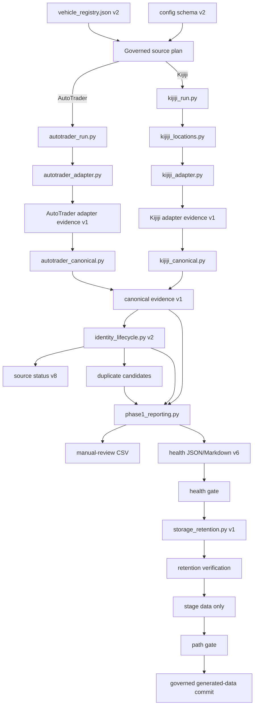

# Architecture and Data Flow

## Purpose

This document describes governed source execution, adapter/canonical boundaries, identity/lifecycle state, bounded retention, supported reporting, and authority limits.

## 1. Operational authority

`vehicle_registry.json` schema v2 controls enabled/paused state, source plan, purpose, priority, cadence metadata, and analysis profile. Each schema-v2 `config_*.json` controls criteria, origin, and source-specific queries. Kijiji labels must resolve through location-registry version 1.

## 2. Workflow orchestration

`.github/workflows/scrape.yml` provides:

- pull requests: dependency setup, compilation, registry/config validation, deterministic/hostile tests
- scheduled full runs: registry plan, reporting, health gate, retention, staged-path validation, and active-scope data commit
- manual full runs: same plan, commit only when explicitly enabled
- manual `single_pair`: one governed vehicle/source, source plus lifecycle validation, seven-day artifact, no repository commit
- generated-data PR events: acknowledgement only

Audit 07 adds pre-commit health, retention, size, and data-path gates. Audit 08 still owns final workflow architecture and dependency locking.

## 3. Direct source paths

### AutoTrader

```text
schema-v2 config
  → autotrader_run.py
    → autotrader_adapter.py
      → requests/pages/response listing objects
      → adapter evidence schema v1
    → autotrader_canonical.py
      → canonical evidence schema v1
    → identity_lifecycle.py
      → identity/lifecycle schema v2
    → source status schema v8
```

Fetched scope is `autotrader_adapter_response_listing_objects`. Request attempts, pagination, duplicates, exclusions, parse failures, and route/geodesic/unavailable distance evidence remain explicit.

### Kijiji

```text
schema-v2 config
  → kijiji_run.py
    → kijiji_locations.py validated hub plan
    → kijiji_adapter.py
      → requests/pages/JSON-LD listing objects
      → adapter evidence schema v1
    → kijiji_canonical.py
      → canonical evidence schema v1
    → identity_lifecycle.py
      → identity/lifecycle schema v2
    → source status schema v8
```

Fetched scope is `kijiji_adapter_json_ld_listing_objects`. Query hub is provenance only, URL region is separate unverified evidence, listing geography is listing-specific source evidence or unknown, and distance remains disabled.

## 4. Canonical boundary

For both sources:

```text
fetched_records = accepted_records + rejected_records + parse_failures
```

Canonical schema v1 preserves raw payload evidence, null-safe normalized values, stable source-scoped canonical listing IDs, run observations, field evidence statuses, explicit reasons, and reconciliation.

Canonical IDs identify listing claims within a source. They are not VINs or physical-vehicle identity.

## 5. Identity and lifecycle boundary

`identity_lifecycle.py` runs only after collection, freshness, schema, pagination, canonical reconciliation, accepted/output agreement, and config isolation have passed.

Per-source state records:

- source listing ID status `source_identifier_claim_not_vin`
- explicit VIN claim evidence: format-valid unverified, invalid, conflicting, or not reported
- strict/loose explainable fingerprints
- `active`, `missing`, `reappeared`, and `retired` lifecycle states
- exact first/last/evaluation timestamps and elapsed seconds/days
- run-ID-idempotent price observations

Retirement requires three consecutive successful-source-run misses and fourteen elapsed days. Lifecycle states are operational inferences, not source-confirmed sold/removal claims.

Before each source run, identity artifacts are snapshotted. Any unhealthy result restores prior state; failed runs cannot advance missing or retirement counters.

### Compact price history

Identity/lifecycle schema v2 keeps:

- total observation count
- first, previous, current, minimum, and maximum price
- the newest thirteen raw observations
- count and chained SHA-256 digest for compacted observations

The digest is accounting evidence, not a raw-history reconstruction format.

### Retired-state bounds

Each source keeps at most 500 retired listings and no tombstone more than 365 days past last successful observation. Pruning writes bounded deletion evidence with cumulative counts/bytes, a chained digest, and the latest 100 detailed deletion records.

## 6. Duplicate candidates

After all current source identities for a vehicle are available, `phase1_reporting.py` builds cross-source duplicate candidates.

- confidence is high, medium, or low
- reasons are visible
- references to both canonical records are preserved
- `decision_status` is `candidate_only_not_merged`

Candidates do not delete, suppress, rewrite, or merge records and do not create purchase-ranking authority.

## 7. Supported reporting

Manual review joins accepted canonical records one-to-one with current identity/lifecycle records. A missing, wrong-run, wrong-schema, or count-mismatched identity artifact excludes the source and triggers the fail-closed integrity guard.

Supported review exposes VIN status, fingerprints, lifecycle state/reason, actual elapsed time, corrected price observations, and duplicate-candidate references. It excludes rank, score, week-named history, and legacy history text.

Source status schema v8 requires identity schema v2, `identity_lifecycle_status: updated`, and identity-current count equal to accepted count. Consolidated health schema v6 aggregates canonical counts plus tracked, new, reappeared, missing, and retired counts.

## 8. Storage-retention boundary

After a full run passes source health, `storage_retention.py` schema v1:

- preserves current `*_latest` artifacts
- keeps eight timestamped source CSVs per active vehicle/source
- keeps four timestamped manual-review CSVs per active vehicle
- removes older matching archives
- removes active-vehicle `price_history_*.json` and historical merged CSVs
- records path, reason, size, SHA-256, run, and deletion time
- bounds detailed file-deletion history to 100 records while preserving cumulative counts/bytes and chained digest
- fails when a managed file exceeds 50 MiB or active managed data exceeds 500 MiB
- leaves paused F-150/Tundra data untouched

After retention, the workflow stages only `data/`. `validate-staged` rejects non-data paths, paused-vehicle paths, and ungoverned vehicle paths before commit.

## 9. Current data flow



## 10. Artifact map

Adapter evidence:

```text
data/<vehicle>/adapter_evidence/<source>/requests_latest.jsonl
data/<vehicle>/adapter_evidence/<source>/records_latest.jsonl
data/<vehicle>/adapter_evidence/<source>/reconciliation_latest.json
```

Canonical evidence:

```text
data/<vehicle>/evidence/<source>/raw_latest.jsonl
data/<vehicle>/evidence/<source>/normalized_latest.jsonl
data/<vehicle>/evidence/<source>/accepted_latest.jsonl
data/<vehicle>/evidence/<source>/rejected_latest.jsonl
data/<vehicle>/evidence/<source>/parse_failures_latest.jsonl
data/<vehicle>/evidence/<source>/reconciliation_latest.json
```

Identity/lifecycle evidence:

```text
data/<vehicle>/identity_lifecycle/<source>/state_latest.json
data/<vehicle>/identity_lifecycle/<source>/current_latest.jsonl
data/<vehicle>/identity_lifecycle/<source>/events_latest.jsonl
data/<vehicle>/identity_lifecycle/<source>/summary_latest.json
data/<vehicle>/identity_lifecycle/duplicate_candidates_latest.jsonl
```

Retention evidence:

```text
data/<vehicle>/retention/latest.json
data/<vehicle>/retention/deletion_ledger.json
data/retention/latest.json
```

Review and health:

```text
data/<vehicle>/run_status/<source>_latest.json
data/<vehicle>/manual_review/<vehicle>_manual_review_latest.csv
data/run_status/latest.json
data/run_status/latest.md
```

Historical merged CSVs and `price_history_*.json` are not supported inputs and are removed for active vehicles by governed retention.

## 11. Authority boundaries

- Registry controls operational scope; configs control criteria/query plans.
- Source values, VIN claims, and normalized values are evidence, not verified truth.
- Query provenance is not listing geography.
- Accepted means eligible for manual review, not recommended.
- Duplicate candidate means compare manually, not merge.
- Missing/retired do not prove sold status.
- Compaction/deletion digests prove accounting order, not reconstructability.
- Audit 07 owns retention; Audit 08 owns final workflow architecture; Audit 09 owns buyer intelligence.
- The owner retains purchase, merge, and roadmap authority.
