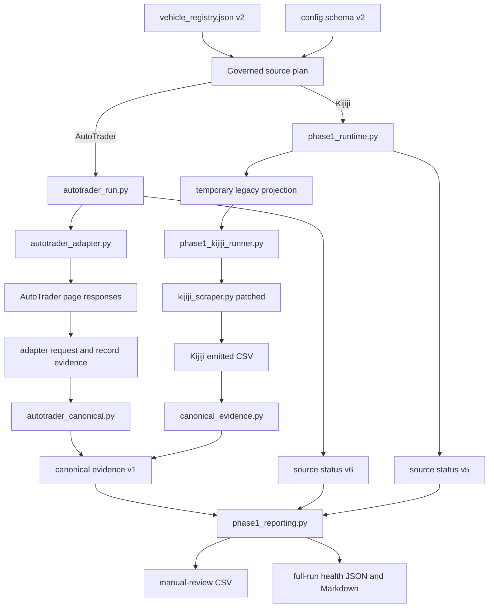

# Architecture and Data Flow

## Purpose

This document describes the governed execution paths, source boundaries, generated evidence, and remaining legacy components.

## 1. Operational authority

`vehicle_registry.json` schema v2 controls enabled/paused state, purpose, priority, cadence metadata, enabled sources, analysis profile, and pause reason.

Each `config_*.json` schema-v2 file controls shared criteria, origin, and separate AutoTrader/Kijiji make/model/location settings. `vehicle_config.py` rejects obsolete and invalid approved fields.

## 2. Workflow orchestration

`.github/workflows/scrape.yml` provides:

- pull request: compilation, registry/config validation, structured tests
- scheduled full run: complete registry plan and generated-data commit
- manual full run: complete registry plan; commit only when explicitly enabled
- manual single-pair run: one governed vehicle/source pair, source-health validation, artifact upload, no repository commit
- generated-data PR event: acknowledgement only

The single-pair path is a limited Audit 04 validation control. Audit 08 owns the final workflow architecture.

## 3. AutoTrader direct adapter

AutoTrader no longer uses the disposable legacy config projection.

```text
schema-v2 config
  → autotrader_run.py
    → autotrader_adapter.py
      → AutoTrader page requests
      → adapter request/record/reconciliation evidence
    → autotrader_canonical.py
      → canonical evidence schema v1
    → source status schema v6
```

### `autotrader_adapter.py`

- builds explicit make/model/location/fuel/page-size/page-offset requests
- retries network failures and selected transient HTTP statuses
- records each attempt and page outcome
- paginates until reported total or short page
- detects repeated pages and maximum-page boundaries
- preserves every returned listing object
- classifies duplicates as rejections
- preserves parse failures and criteria exclusions with reasons
- produces unranked accepted CSV rows
- does not mutate config or search locations

AutoTrader fetched scope is:

```text
autotrader_adapter_response_listing_objects
```

### `autotrader_distance.py`

Distance evidence is explicit:

- `route_api_address`
- `route_api_city_center`
- `geodesic_address`
- `geodesic_city_center`
- `unavailable`

Evidence status distinguishes route distance, straight-line estimate, and unavailable geography.

### `autotrader_canonical.py`

The canonical layer consumes the adapter records rather than reconstructing rejected/failed evidence from accepted CSV rows. It verifies adapter schema/run identity/counts/index continuity and preserves query provenance.

## 4. Kijiji interim path

Kijiji remains:

```text
schema-v2 config
  → phase1_runtime.py
    → disposable legacy projection
      → phase1_kijiji_runner.py
        → runtime-patched kijiji_scraper.py
    → canonical_evidence.py from emitted CSV rows
    → source status schema v5
```

The runner disables geocoding, distance processing, location filtering, ranking, and search-location mutation. Kijiji location/address/distance are preserved as raw evidence but quarantined from normalized decision fields. Audit 05 replaces this path.

## 5. Canonical evidence

For every source:

```text
fetched_records = accepted_records + rejected_records + parse_failures
```

Canonical schema v1 provides:

- exact raw evidence
- typed/null-safe normalized values
- stable source-scoped canonical listing IDs
- run-specific observation IDs
- per-field evidence status
- source listing IDs explicitly distinct from VIN
- accepted/rejected/parse-failure artifacts
- machine-readable reasons
- reconciliation JSON

Boundary differs by source:

| Source | Fetched boundary |
|---|---|
| AutoTrader | response listing objects from the direct adapter |
| Kijiji | rows emitted by the legacy collector CSV |

## 6. Evidence-backed reporting

`phase1_reporting.py`:

- consumes the governed source plan
- requires current successful status and recognized canonical evidence
- reads `accepted_latest.jsonl`, not source CSV, for manual review
- writes unranked manual-review CSVs with evidence statuses
- writes consolidated JSON/Markdown health on full runs
- preserves Kijiji geography quarantine

A source status may be schema v6 for AutoTrader or schema v5 for Kijiji. The shared health predicate requires current success, fresh valid output, accepted records, canonical schema v1, reconciliation, no cap, and config isolation. AutoTrader runtime additionally requires complete pagination and adapter/output count agreement before it can report success.

## Current data flow



## Artifact map

### AutoTrader adapter evidence

| Path | Meaning |
|---|---|
| `adapter_evidence/autotrader/requests_latest.jsonl` | query/page URL, attempts, HTTP outcomes, stop reason |
| `adapter_evidence/autotrader/records_latest.jsonl` | every response listing object, raw payload, provenance, stage and reasons |
| `adapter_evidence/autotrader/reconciliation_latest.json` | pagination, request counts and adapter equation |

### Canonical evidence

Under `data/<vehicle>/evidence/<source>/`:

| Artifact | Meaning |
|---|---|
| `raw_latest.jsonl` | exact source-boundary evidence |
| `normalized_latest.jsonl` | typed/null-safe transformations |
| `accepted_latest.jsonl` | current manual-review inputs |
| `rejected_latest.jsonl` | explicit exclusions |
| `parse_failures_latest.jsonl` | failed records with reasons |
| `reconciliation_latest.json` | counts, fetched scope, completeness state and paths |

### Run and review evidence

| Artifact | Meaning |
|---|---|
| `data/<vehicle>/run_status/<source>_latest.json` | source execution and evidence health |
| `data/run_status/latest.json` | registry-wide health from a full run |
| `data/run_status/latest.md` | readable full-run health |
| `data/<vehicle>/manual_review/<vehicle>_manual_review_latest.csv` | supported accepted records |
| `data/<vehicle>/merged/*.csv` | disabled historical output |

## Authority boundaries

- registry controls operational scope
- approved configs control criteria
- AutoTrader reads approved config directly but cannot mutate it
- Kijiji temporary projection remains compatibility only
- source values are evidence, not verified truth
- normalized values are transformations, not verification
- accepted means eligible for manual review, not recommended
- rejected and failed records remain evidence
- source listing IDs are not VINs
- owner retains purchase, merge, and roadmap authority

## Remaining work

Audit 05 moves Kijiji to a direct adapter and verified-or-unknown geography. Audit 06 adds identity, deduplication, and lifecycle. Audit 07 defines retention. Audit 08 finalizes CI/workflow structure.
