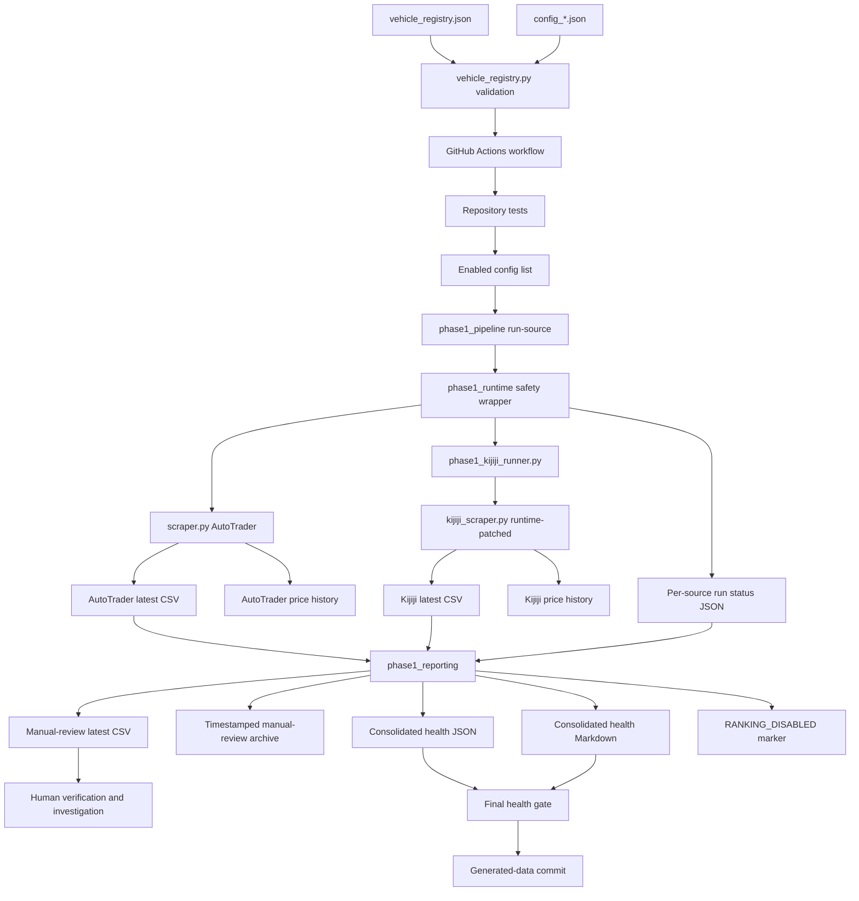

# Architecture and Data Flow

## Purpose

This document describes the repository's current execution architecture and generated artifacts. It distinguishes the supported flow from legacy and interim behaviour.

## Current execution layers

### 1. Scope and configuration

- `vehicle_registry.json` defines enabled and paused vehicles.
- `vehicle_registry.py` validates the registry and emits enabled config paths.
- `config_*.json` files contain per-vehicle source criteria.
- `trim_tiers.json` supplies legacy trim keyword tiers to both collectors.

Operational enablement is controlled only by the registry. Collector criteria remain in the vehicle configs.

### 2. Workflow orchestration

`.github/workflows/scrape.yml` provides three paths:

- normal pull request: compile, validate registry and run tests
- scheduled/manual workflow: test first, then collect enabled vehicles
- GitHub Actions generated-data commit PR event: acknowledgement only

The collection workflow reads enabled config paths from the registry separately for source collection, manual-review generation and health reporting. This repeated derivation protects all stages from scope drift.

### 3. Phase 1 safety orchestration

`phase1_pipeline.py` exposes commands for:

- running one source
- building manual-review files
- writing consolidated health evidence
- failing the workflow when an expected enabled source is unhealthy

`phase1_runtime.py` wraps each source collector and provides:

- isolated temporary config
- runtime override of the legacy result cap
- 75-minute timeout
- captured stdout and stderr tails
- current-versus-stale output detection
- minimum CSV schema validation
- limited data-quality warnings
- price-history rollback after failure
- same-day history deduplication
- structured per-source run status

### 4. Source collectors

#### AutoTrader

The workflow executes:

```text
phase1_runtime → scraper.py
```

`scraper.py` remains an active legacy collector. The safety wrapper controls runtime and output evidence but does not repair its internal pagination, parsing, distance or ranking design.

#### Kijiji

The workflow executes:

```text
phase1_runtime → phase1_kijiji_runner.py → runtime-patched kijiji_scraper.py
```

`phase1_kijiji_runner.py` is an interim safety adapter. It replaces exact source-code anchors before executing `kijiji_scraper.py`. The adapter:

- disables geocoding and distance processing
- disables location-based filtering
- disables legacy source ranking
- disables automatic location-list mutation
- adds URL-region hint fields
- preserves source records using only non-location filters

This is current operating behaviour, not the approved final collector architecture.

### 5. Reporting

`phase1_reporting.py`:

- includes only current successful source runs for the active run ID
- transforms source rows into the supported manual-review schema
- removes rank and score fields
- quarantines Kijiji search-origin location values
- creates timestamped and latest manual-review CSV files
- creates `RANKING_DISABLED.md` in each merged-output directory
- writes consolidated Markdown and JSON health reports

## Current data flow



## Artifact map

### Registry and configuration

| Artifact | Producer | Consumer | Authority |
|---|---|---|---|
| `vehicle_registry.json` | owner-approved change | workflow and registry utility | authoritative for enabled state |
| `config_*.json` | owner-approved change; legacy collectors may try to mutate runtime copies | collectors | source criteria, not enablement |
| `trim_tiers.json` | owner-approved change | collectors | legacy trim keyword mapping |

### Current source output

| Artifact | Producer | Consumer | Notes |
|---|---|---|---|
| `data/<vehicle>/latest/<vehicle>_autotrader_latest.csv` | `scraper.py` | Phase 1 reporting and diagnostics | may contain legacy rank/score fields |
| `data/<vehicle>/latest/<vehicle>_kijiji_latest.csv` | patched Kijiji execution | Phase 1 reporting and diagnostics | location and distance are not trustworthy for decision use |
| timestamped source CSV | source collector | historical diagnostics | currently retained without a bounded policy |

### Price history

| Artifact | Producer | Consumer | Notes |
|---|---|---|---|
| `data/<vehicle>/price_history_autotrader.json` | AutoTrader collector | legacy trend fields | observations are not a complete lifecycle model |
| `data/<vehicle>/price_history_kijiji.json` | Kijiji collector | legacy trend fields | same limitation |

### Run evidence

| Artifact | Producer | Consumer | Notes |
|---|---|---|---|
| `data/<vehicle>/run_status/<source>_latest.json` | `phase1_runtime.py` | reporting and human diagnostics | records current/stale rows, timeout, schema and warning evidence |
| `data/run_status/latest.json` | `phase1_reporting.py` | final health gate and humans | machine-readable consolidated report |
| `data/run_status/latest.md` | `phase1_reporting.py` | GitHub summary and humans | readable consolidated report |

### Supported manual review

| Artifact | Producer | Consumer | Notes |
|---|---|---|---|
| `data/<vehicle>/manual_review/<vehicle>_manual_review_latest.csv` | `phase1_reporting.py` | human review | current supported listing set |
| timestamped manual-review CSV | `phase1_reporting.py` | historical review | currently retained without a bounded policy |

### Disabled historical output

| Artifact | Producer | Current use |
|---|---|---|
| `data/<vehicle>/merged/*.csv` | disabled `merge.py` flow | historical only; not a recommendation |
| `data/<vehicle>/merged/RANKING_DISABLED.md` | Phase 1 reporting | warning and redirect to manual review |

## Freshness and health logic

A source is treated as current and healthy only when all of these are true for the active run:

- run ID matches
- collector execution status is `success`
- output was updated during the run
- minimum schema is valid
- current row count is greater than zero
- legacy row cap was disabled
- approved config remained isolated

A preserved older file is counted as stale, not current.

The overall run status is:

- `degraded` when any expected source is unhealthy
- `success_with_warnings` when all expected sources are healthy but one or more have row warnings
- `success` when all expected sources are healthy and no warning rows are detected

## Data loss visibility boundary

The current architecture records whether the final source CSV is fresh and valid. It does not reconcile:

```text
fetched records = accepted records + rejected records + parse failures
```

Raw records, rejected records and parsing failures are not yet preserved as first-class artifacts. Therefore, successful collection does not prove completeness. Audit 03 and the source-specific audits are responsible for creating that evidence chain.

## Authority boundaries

- Registry enablement determines workflow scope.
- Vehicle configs determine current collector criteria.
- Source CSV values are evidence from parsing, not verified truth.
- Manual-review transformation controls which fields may be presented for human decision use.
- Health status describes collection execution and limited data quality; it is not a vehicle-quality rating.
- The repository owner retains all purchase, sale, merge and roadmap authority.

## Target direction

The approved roadmap will progressively replace the current architecture with:

- validated configuration governance
- canonical raw/normalized/accepted/rejected schemas
- directly testable source adapters
- verified or explicitly unknown geography
- transparent identity and lifecycle evidence
- bounded storage retention
- purpose-specific decision-support outputs

Until those audits are complete, the current Phase 1 flow remains a controlled interim system.