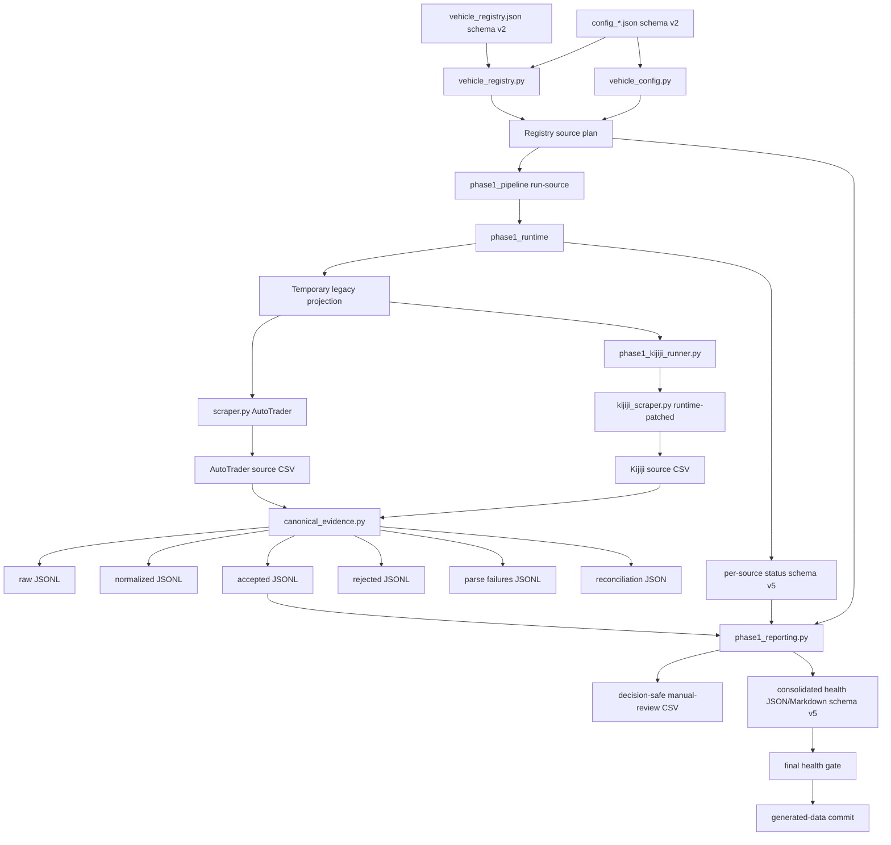

# Architecture and Data Flow

## Purpose

This document describes the current execution architecture and generated artifacts. It distinguishes governed, supported flow from legacy source behaviour and explicitly defines the Audit 03 canonical boundary.

## Current execution layers

### 1. Operational registry

`vehicle_registry.json` schema v2 is the sole authority for enabled/paused state, purpose, priority, cadence metadata, enabled sources, analysis profile, and pause reason. `vehicle_registry.py` validates the registry and every referenced config before emitting the ordered active vehicle/source run plan.

### 2. Governed source criteria

Each `config_*.json` schema-v2 file contains shared year/price/fuel/engine criteria, origin settings, and separate AutoTrader/Kijiji query settings. `vehicle_config.py` rejects obsolete or invalid approved fields. Legacy flat controls exist only in a disposable runtime projection.

### 3. Workflow orchestration

`.github/workflows/scrape.yml` provides:

- pull request: compilation, registry/config validation, and tests
- scheduled/manual run: tests first, then registry-driven collection
- generated-data commit: acknowledgement only

Collection, evidence generation, manual review, and health reporting all use the same registry source plan.

### 4. Runtime compatibility and source execution

`phase1_runtime.py`:

1. validates the approved schema-v2 config
2. creates a source-specific temporary legacy projection
3. injects an effectively unbounded result cap
4. runs the collector with a 75-minute timeout
5. verifies the approved config remained byte-for-byte unchanged
6. checks output freshness and minimum source schema
7. invokes the canonical evidence layer for every fresh valid source CSV
8. requires reconciliation and at least one accepted record
9. records source, evidence, warning, history, and failure status

The compatibility projection is collector input only. It is not approved configuration authority.

### 5. Legacy source collectors

AutoTrader currently runs through `scraper.py`. Kijiji runs through `phase1_kijiji_runner.py`, which runtime-patches `kijiji_scraper.py` and disables unsafe geography, distance, ranking, and location mutation behaviour.

Audit 03 does not refactor either collector. Therefore, source-level request counts, HTTP payloads, skipped parser records, and true marketplace fetch completeness remain unavailable until Audits 04 and 05.

### 6. Canonical evidence layer

`canonical_evidence.py` begins at the fresh collector CSV boundary.

For every collector-emitted row it:

- preserves exact raw CSV strings
- generates a stable source-scoped `canonical_listing_id`
- generates a run-specific `observation_id`
- normalizes typed values with real JSON nulls
- records per-field provenance/evidence status
- keeps source listing IDs distinct from VIN
- quarantines Kijiji location/distance values
- classifies the row as accepted, rejected, or parse failure
- writes machine-readable reasons
- enforces count reconciliation

Current reconciliation scope is explicitly `legacy_collector_emitted_csv_rows`:

```text
fetched_records = accepted_records + rejected_records + parse_failures
```

This proves no row disappears after the canonical boundary. It does not prove no record disappeared inside a legacy collector before CSV output.

### 7. Evidence-backed reporting

`phase1_reporting.py`:

- consumes only enabled source pairs
- includes only current successful sources with reconciled evidence
- loads `accepted_latest.jsonl`, not the raw collector CSV
- writes a decision-safe manual-review CSV with canonical IDs and evidence statuses
- removes source ranking and misleading legacy field names from supported output
- writes consolidated JSON/Markdown health with reconciliation totals
- keeps Kijiji location evidence quarantined
- maintains the historical-ranking disabled marker

## Current data flow



## Artifact map

### Authority and runtime input

| Artifact | Authority/role |
|---|---|
| `vehicle_registry.json` | operational scope and enabled-source authority |
| `config_*.json` | approved source criteria |
| temporary runtime config | disposable legacy compatibility only |
| `trim_tiers.json` | active legacy keyword configuration |

### Collector artifacts

| Artifact | Role and limit |
|---|---|
| `data/<vehicle>/latest/<vehicle>_<source>_latest.csv` | fresh collector-emitted rows; may contain legacy fields |
| timestamped source CSV | diagnostic history with unbounded retention pending Audit 07 |
| source price-history JSON | legacy observation history, not lifecycle authority |

### Canonical evidence artifacts

| Artifact | Role |
|---|---|
| `raw_latest.jsonl` | exact collector CSV strings |
| `normalized_latest.jsonl` | typed/null-safe normalized rows |
| `accepted_latest.jsonl` | current supported review inputs |
| `rejected_latest.jsonl` | exclusions with reasons |
| `parse_failures_latest.jsonl` | malformed/failed rows with reasons |
| `reconciliation_latest.json` | counts, scope caveat, paths, and equality result |

All canonical artifacts live under `data/<vehicle>/evidence/<source>/`.

### Run evidence and supported review

| Artifact | Role |
|---|---|
| `data/<vehicle>/run_status/<source>_latest.json` | source execution plus canonical evidence status |
| `data/run_status/latest.json` | registry-wide health and reconciliation totals |
| `data/run_status/latest.md` | readable health summary |
| `data/<vehicle>/manual_review/<vehicle>_manual_review_latest.csv` | supported decision-safe accepted records |
| timestamped manual-review CSV | review history pending retention policy |
| `data/<vehicle>/merged/*.csv` | disabled historical output only |

## Health contract

A source is healthy only when:

- the run ID is current
- execution succeeded
- output is fresh
- minimum source schema is valid
- current collector-emitted rows are non-zero
- canonical evidence schema version is recognized
- accepted record count is non-zero
- evidence reconciliation status is `reconciled`
- result cap is disabled
- approved config isolation is true

Overall status is `degraded` when any enabled source pair is unhealthy, `success_with_warnings` when all pairs are healthy but warnings exist, and `success` when all pairs are healthy without warning rows.

## Authority boundaries

- registry controls operational vehicle/source scope
- governed configs control source criteria
- temporary projection is compatibility, not authority
- collector CSV values are unverified evidence
- raw canonical values preserve what the collector emitted
- normalized values are transformations, not verification
- accepted means structurally eligible for manual review, not purchase-approved
- rejected/parse-failure records remain evidence and are not silently discarded
- source listing IDs are not VIN or cross-source identity
- manual review governs human-facing presentation
- owner retains purchase, sale, merge, and roadmap authority

## Remaining boundary

Audits 04 and 05 must move the raw/fetched boundary into directly testable source adapters so request, response, parser, accepted, rejected, and parse-failure counts reconcile from the marketplace fetch itself. Audit 06 then adds identity/deduplication/lifecycle semantics. Audit 07 addresses evidence retention and repository growth.
