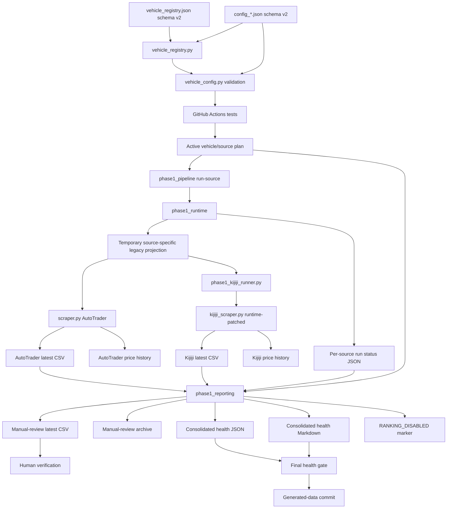

# Architecture and Data Flow

## Purpose

This document describes current execution architecture and generated artifacts. It distinguishes governed, supported flow from legacy and interim behaviour.

## Current execution layers

### 1. Operational registry

`vehicle_registry.json` schema v2 is the sole authority for:

- enabled/paused state
- purpose and priority
- cadence metadata
- enabled sources
- purpose-linked analysis profile
- pause reason

`vehicle_registry.py` validates the registry and every referenced config before emitting either unique active config paths or the ordered active vehicle/source run plan.

### 2. Governed source criteria

Each `config_*.json` schema-v2 file contains:

- human-facing vehicle identity
- shared year, price, fuel and engine criteria
- origin and intended distance boundary
- separate AutoTrader make/model/location settings
- separate Kijiji make/model/location settings

`vehicle_config.py` rejects unknown/obsolete fields, invalid ranges, invalid coordinates, unsupported location formatting and duplicate locations.

Approved configs never contain legacy `max_results`, `ranking_weights` or one shared `search_locations` authority.

### 3. Workflow orchestration

`.github/workflows/scrape.yml` provides:

- normal pull request: compile, validate governed registry/configs and run tests
- scheduled/manual workflow: test first, then execute the registry's active source plan
- generated-data PR event: acknowledgement only

Collection, manual-review generation and health reporting all consume the same registry source plan. A source removed from `enabled_sources` is omitted from all three stages.

### 4. Phase 1 runtime compatibility and safety

`phase1_pipeline.py` exposes commands for source execution, manual-review generation, health reporting and final health enforcement.

`phase1_runtime.py`:

1. loads and validates the approved schema-v2 config
2. derives the selected source's settings
3. creates a temporary flat legacy config via `vehicle_config.py`
4. injects effectively unbounded `max_results` and compatibility-only ranking weights
5. substitutes the temporary path into the collector command
6. runs the collector with a 75-minute timeout
7. verifies the approved config remained byte-for-byte unchanged
8. records freshness, schema, current/stale rows, warnings, failures and projection evidence
9. protects price history from failed runs and same-day duplication

The compatibility file is disposable collector input, not approved authority.

### 5. Source collectors

#### AutoTrader

```text
registry/config validation
  → phase1_pipeline
  → phase1_runtime
  → temporary AutoTrader legacy projection
  → scraper.py
```

`scraper.py` remains legacy. Audit 02 governs its input but does not repair pagination, parse-failure visibility, distance evidence or internal source ranking.

#### Kijiji

```text
registry/config validation
  → phase1_pipeline
  → phase1_runtime
  → temporary Kijiji legacy projection
  → phase1_kijiji_runner.py
  → runtime-patched kijiji_scraper.py
```

The Kijiji adapter still disables geocoding, distance processing, location filtering, source ranking and automatic location-list mutation, while adding URL-region hints. Runtime source rewriting remains temporary until Audit 05.

### 6. Reporting

`phase1_reporting.py` consumes the registry source plan. It:

- expects only enabled source pairs
- includes only current successful rows for the active run
- removes rank and score from manual review
- quarantines Kijiji search-origin values
- writes timestamped/latest review CSVs
- writes consolidated Markdown/JSON health reports
- creates `RANKING_DISABLED.md` in merged directories

## Current data flow



## Artifact map

### Registry and configuration

| Artifact | Producer | Consumer | Authority |
|---|---|---|---|
| `vehicle_registry.json` | owner-approved change | workflow, registry utility, reporting plan | operational scope/source authority |
| `config_*.json` | owner-approved change | config validator/runtime projector | approved source criteria |
| temporary runtime config | `vehicle_config.py` through `phase1_runtime.py` | one legacy collector process | compatibility only; deleted after run |
| `trim_tiers.json` | owner-approved change | collectors | legacy trim keywords |

### Source output

| Artifact | Producer | Consumer | Notes |
|---|---|---|---|
| `data/<vehicle>/latest/<vehicle>_autotrader_latest.csv` | `scraper.py` | reporting/diagnostics | may contain legacy rank/score |
| `data/<vehicle>/latest/<vehicle>_kijiji_latest.csv` | patched Kijiji execution | reporting/diagnostics | geography not trustworthy |
| timestamped source CSV | collector | diagnostics/history | retention not bounded |
| source price-history JSON | collector | legacy trend fields | not a lifecycle model |

### Run evidence and supported review

| Artifact | Producer | Consumer | Notes |
|---|---|---|---|
| `data/<vehicle>/run_status/<source>_latest.json` | runtime | reporting/humans | includes schema-v2/projection/isolation evidence |
| `data/run_status/latest.json` | reporting | health gate/humans | registry-source-aware expected runs |
| `data/run_status/latest.md` | reporting | GitHub summary/humans | readable health evidence |
| `data/<vehicle>/manual_review/<vehicle>_manual_review_latest.csv` | reporting | human review | supported listing set |
| timestamped manual-review CSV | reporting | history | retention not bounded |
| `data/<vehicle>/merged/*.csv` | disabled merger | none | historical only |

## Freshness and health logic

A source is healthy only when its run ID matches, execution succeeded, output is fresh, minimum schema is valid, current rows are non-zero, row cap is disabled and approved config isolation is true. Preserved older files are stale, never current.

Overall status is `degraded` when any enabled pair is unhealthy, `success_with_warnings` when all are healthy but row warnings exist, and `success` when all are healthy without current warning rows.

## Data loss visibility boundary

The current architecture still does not reconcile:

```text
fetched records = accepted records + rejected records + parse failures
```

Raw, rejected and parse-failure artifacts belong to Audit 03 and source audits. Successful execution does not prove completeness.

## Authority boundaries

- registry determines operational vehicle/source scope
- governed configs determine source-specific criteria
- temporary legacy projection is compatibility, not authority
- source CSV values are parsed evidence, not verified truth
- manual-review transformation governs human-facing presentation
- health describes collection execution and limited warning rules, not vehicle quality
- the owner retains purchase, sale, merge and roadmap authority

## Target direction

Later packages add canonical evidence stages, direct source adapters, verified/unknown geography, lifecycle and identity evidence, bounded storage and purpose-specific decision support. Phase 1 remains controlled interim operation until those replacements are proven.
